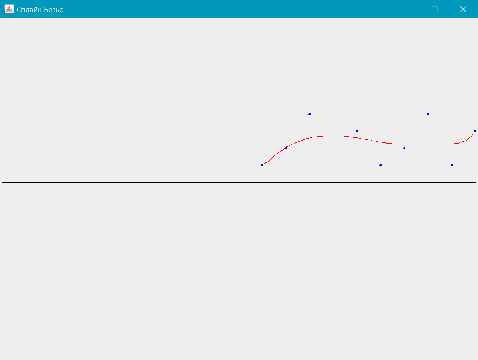

# Сплайн Безьє
Сплайн Безьє — параметрично задана крива, яка використовується 
в комп'ютерній графіці та суміжних областях.

У векторній графіці, сплайн Безьє використовуються для моделювання гладких кривих, 
які можна масштабувати до нескінченності.

Сплайн Безьє був запроваджений в 1962 році П'єром Безьє з 
автомобілебудівної компанії «Рено», хоча ще в 1959 році 
використовувався Полем де Кастельє з компанії «Сітроен», 
але його дослідження не публікувались і приховувались 
компанією як комерційна таємниця до кінця 1960-х.

Іменем де Кастельє названо його рекурсивний спосіб визначення 
кривих (алгоритм де Кастельє).

Сплайн Безьє — параметрична крива, вигляду

де  — опорні вершини,

 — поліноми Бернштейна, вони є базисними функціями сплайну Без'є.

Також існує рекурсивна формула побудови сплайну Безьє:

## Властивості сплайну Безьє
* безперервність заповнення сегмента між початковою та кінцевою точками;
* сплайн завжди розташовується всередині фігури, утвореної лініями, що з'єднують контрольні точки;
* при наявності лише двох контрольних точок сегмент являє собою пряму лінію;
* пряма лінія утворюється лише тоді, коли контрольні точки розташовані на одній прямій;
* сплайн Безьє симетричний, тобто обмін місцями між початковою та кінцевою точками (зміна напрямку траєкторії) не впливає на форму кривої;
* масштабування та зміна пропорцій сплайну Безьє не порушує його стабільності, оскільки він з математичної точки зору «аффінно інваріантний»;
* зміна координат хоча б однієї з точок веде до зміни форми всього сплайну Безьє;
* будь-який частковий відрізок сплайну Безьє також є сплайном Безьє;
* степінь сплайну завжди на одиницю менший від кількості контрольних точок. Наприклад, при трьох контрольних точках форма сплайну — парабола;
* коло не може бути описане параметричним рівнянням сплайном Безьє;
## Застосування в комп'ютерній графіці
Завдяки простоті завдання і виконанню операцій, сплайн Безьє 
знайшов широке застосування в комп'ютерній графіці для 
моделювання гладких ліній. Сплайн цілком лежить в опуклій 
оболонці своїх опорних точок. Ця властивість сплайну Безьє 
з одного боку значно полегшує завдання знаходження точок перетину 
кривих (якщо не перетинаються опуклі оболонки опорних точок, то 
не перетинаються і самі криві), а з іншого боку дозволяє здійснювати 
інтуїтивно зрозуміле управління параметрами сплайну в за допомогою 
її опорних точок. Крім того, афінні перетворення сплайну 
(перенесення, масштабування, обертання та ін.) також можуть 
бути виконані через застосування відповідних перетворень 
до опорних точок.

Найбільше значення має сплайн Безьє другого та третього ступенів 
(квадратичний і кубічний). Сплайни вищих ступенів при обробці 
вимагають більшого обсягу обчислень і для практичних цілей 
використовуються рідше. Для побудови складних за формою ліній, 
окремі криві Безьє можуть бути послідовно з'єднані один з одним 
в сплайн Безьє. Для того, щоб забезпечити гладкість лінії в 
місці з'єднання двох кривих, три суміжні опорні точки обох 
кривих повинні лежати на одній прямій.
## Приклад роботи програми
### Контрольні точки:
1. (1, 1)
1. (2, 2)
1. (3, 4)
1. (5, 3)
1. (7, 2)
1. (6, 1)
1. (8, 4)
1. (9, 1)
1. (10, 3)
### Вигляд сплайну Безьє, який був побудований розробленою програмою:
